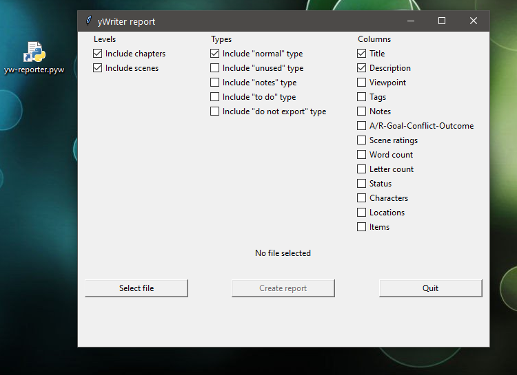

[yWriter](http://spacejock.com/yWriter7.html) is a free word processor written by Australian author and programmer Simon Haynes. 

yWriter projects include a variety of metadata about chapters and scenes in addition to the actual novel text. To display this metadata clearly, yWriter can output different HTML reports. 

If the prefabricated reports are not enough for you, you can use the *yw-reporter* Python script to create configurable tables and display them in the web browser. This works with *.yw7* project files. 

Alternatively, the report can be generated as a CSV file for spreadsheet programs.

The *yw-reporter* script has a graphical user interface. However, a Python 3 installation is required to run it.

## Requirements

- [Python 3](https://www.python.org). Python 3.4 or more recent will work.

## Download and install

[Download the latest release (version 1.7.0)](https://raw.githubusercontent.com/peter88213/yw-reporter/main/dist/yw-reporter_v1.7.0.zip)

- Unzip the downloaded zipfile "yw-reporter_v1.7.0.zip" into a new folder.
- Move into this new folder and launch **setup.pyw**. This installs the script for the local user.
- Create a shortcut on the desktop when asked.
- Open "README.md" for usage instructions.

### Note for Linux users

Please make sure that your Python3 installation has the *tkinter* module. On Ubuntu, for example, it is not available out of the box and must be installed via a separate package. 

------------------------------------------------------------------

[Changelog](changelog)

## Usage, Options reference

See the [instructions for use](usage)

## See also

If you want to be even more flexible, and know HTML, take a look at the template-based [yw2html](https://peter88213.github.io/yw2html) report generator.

## License

yw-reporter is distributed under the [MIT
License](http://www.opensource.org/licenses/mit-license.php).
